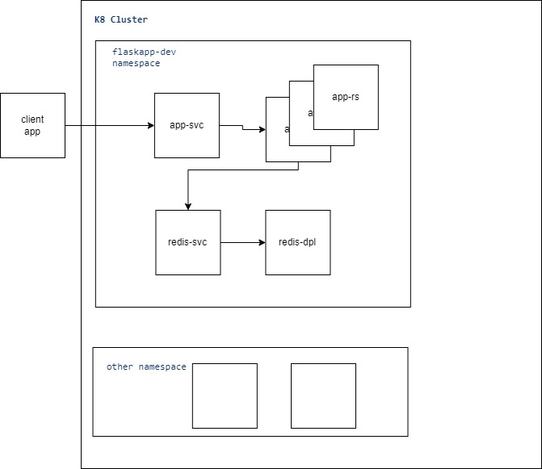

# sample flask with redis

## Manually execute the app
- ⚠Must have redis installed locally!
	- sudo apt update
	- sudo apt install -y redis-server
	- sudo service redis status
- Set env REDIS_HOSTNAME
	- Windows: 
		- SET REDIS_HOSTNAME=localhost
	- Linux: 
		- export REDIS_HOSTNAME=localhost
- python3 flask_app.py

### Endpoints
	- curl localhost:5000/
	- curl localhost:5000/set_price/[int:price]
		- example: curl localhost:5000/set_price/2346
	- curl localhost:5000/get_price

## Build images
- docker build --tag=ricardoahumada/redis -f redis/Dockerfile .
- docker build --tag=ricardoahumada/flaskappforredis -f app/Dockerfile .

## Run images
- ⚠remember to stop redis on localhost and unset ENV:
	- sudo service redis stop
	- unset REDIS_HOSTNAME
- docker run --detach --publish=6379:6379 --name=redis ricardoahumada/redis
	- ⚠Set REDIS_HOSTNAME to redis IP:
		- docker inspect container redis | more
		- export REDIS_HOSTNAME=[IP]
- docker run -d -p=5000:5000 -e REDIS_HOSTNAME=172.17.0.2 --name=flaskappforredis ricardoahumada/flaskappforredis
	- To verify execute:
		- docker run -it -p=5000:5000 -e REDIS_HOSTNAME=172.17.0.2  --name=flaskappforredis ricardoahumada/flaskappforredis

## Push images
- docker push ricardoahumada/redis
- docker push ricardoahumada/flaskappforredis

## Deploy in kubernetes
- Architecture:
	- 
- Create namespace:
	- kubectl apply -f flaskappwithredis/app-ns.yaml
- Create redis service:
	- kubectl apply -f flaskappwithredis/redis-rs.yaml
	- kubectl apply -f flaskappwithredis/redis-svc.yaml
- Create flask service:
	- kubectl apply -f flaskappwithredis/flaskapp-rs.yaml
	- kubectl apply -f flaskappwithredis/flaskapp-svc.yaml
- Forward port:
	- kubectl port-forward service/flaskapp-service 5000:5000 -n flaskapp-dev

## Inspect
- kubectl get namespaces
- kubectl get all -n flaskapp-dev
- kubectl get services -n flaskapp-dev
- kubectl describe service/flaskapp-service -n flaskapp-dev
- kubectl get replicasets -n flaskapp-dev
- kubectl describe replicaset/flaskapp -n flaskapp-dev
- kubectl get deployments -n flaskapp-dev
- Show logs:
	- kubectl logs replicaset/flaskapp -n flaskapp-dev 
	- kubectl logs deployment/redis -n flaskapp-dev 
- Go inside a pod:
	- kubectl exec --stdin --tty [pod_name] -n flaskapp-dev -- /bin/sh 
- Print env from a pod:
	- kubectl exec [pod_name] -- printenv -n flaskapp-dev | grep SERVICE

## Create contexts with namespace to work:
- kubectl config set-context flaskapp-dev --namespace=flaskapp-dev --cluster=minikube --user=minikube
- kubectl config get-contexts
- kubectl config use-context flaskapp-dev
- kubectl config current-context
- kubectl get all

## Clean up
- kubectl delete service flaskapp-service -n  flaskapp-dev
- kubectl delete replicaset flaskapp -n flaskapp-dev
- kubectl delete service redis -n  flaskapp-dev
- kubectl delete deployment redis-dep -n flaskapp-dev
- OR all in all:
	- kubectl delete all --all -n flaskapp-dev
- kubectl config use-context minikube

## Using kustomization.yaml

## Create
- kubectl apply -k ./
- kubectl port-forward service/flaskapp-service 5000:5000 -n flaskapp-dev

## Delete/clean up
- kubectl delete -k ./
